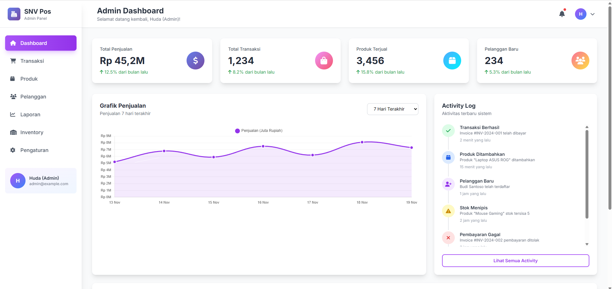
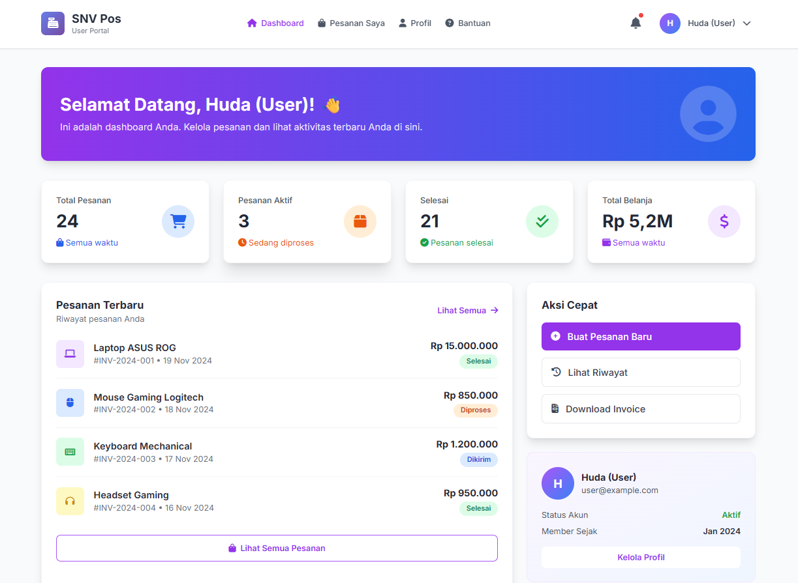
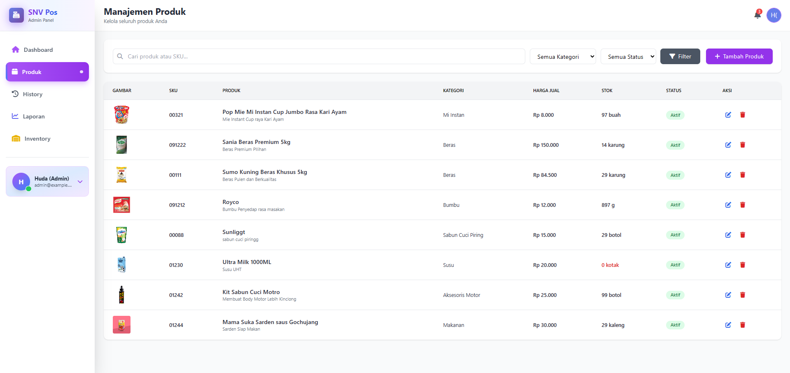
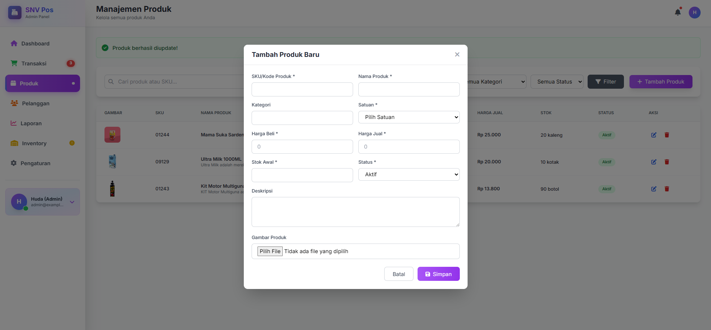
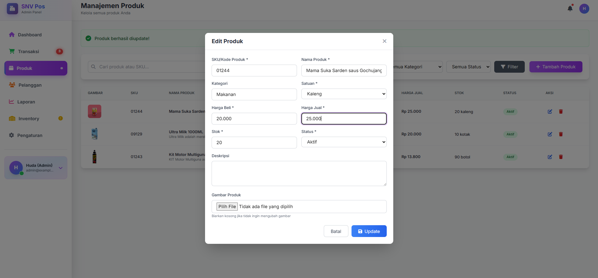

# 💼 E-Business 2 - Tugas Semester 5

**Sistem Point of Sale (POS) berbasis Web**  
Dibangun menggunakan Laravel Framework untuk memenuhi tugas mata kuliah E-Business 2

---

## 👥 User Roles

| Role | Username | Password | Akses |
|------|----------|----------|-------|
| **Admin** | admin@example.com | admin123 | Full Access |
| **User** | user@example.com | user123 | Limited Access |
| **Admin** | admin2@example.com | admin123 | Full Access |

---

## 📋 Deskripsi Project

Aplikasi **SNV Pos** adalah sistem Point of Sale berbasis web yang dirancang untuk memudahkan manajemen transaksi penjualan. Aplikasi ini memiliki dua role utama: **Admin** dan **User**, dengan fitur-fitur yang disesuaikan untuk masing-masing peran.

---

## 📸 Screenshots

### 🔐 Login Page
Halaman login dengan desain modern dan user-friendly interface.

---

### 👨‍💼 Dashboard Admin
Dashboard admin lengkap dengan statistik penjualan, grafik, dan activity log real-time.

---

### 👤 Dashboard User
Dashboard user dengan tampilan ringkas menampilkan riwayat pesanan dan informasi akun.

---

### 🛍️ Daftar Produk
Daftar Produk untuk menage produk

---

### ➕ Tambah Produk
Tambah Produk fitur untuk menambahkan atau mendaftarkan produk

---

### 🖊️ Edit Produk
Fitur untuk Mengdit ulang produk yg telah terdaftar

---

### 🧩 Route List
Daftar lengkap route yang tersedia dalam aplikasi (via `php artisan route:list`).

---
